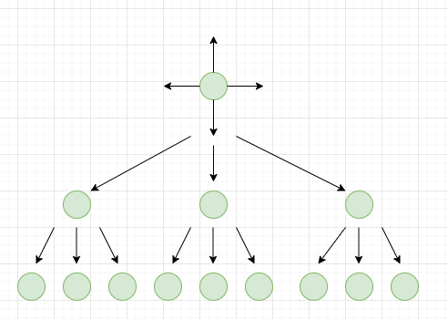

# Programeertheorie-Protein-Powder-2021

###  Case

Eitwitten zijn lange strengen van hydrofobe (H) en polaire (P) aminozuren die belangrijk zijn voor verschillende processen in het lichaam. De configuratie, ofwel vouwing van zo een eiwit is bepalend voor het functioneren ervan; verkeerd opgevouwen eiwitten staan aan de basis van verschillende ziektes als kanker, Alzheimer en taaislijmziekte.

Het mechanisme van de ewitten is als volgt: De hydrofobe aminozuren van een eiwit willen graag 'naast elkaar' liggen. De polaire aminozuren hebben deze voorkeur niet. Als er twee hydrofobe aminozuren naast elkaar liggen ontstaat er een zogeheten 'H-bond' tussen deze aminozuren. Hoe meer 'H-bonds' een eiwit bevat, hoe stabieler dat eiwit is. Het doel is dus om de gegeven eiwitten zo op te vouwen, dat ze zo stabiel mogelijk zijn. 

Er wordt uitgegaan van een 2D grid waarbij ieder aminozuur op een gridpunt komt te liggen. Het volgende aminozuur ligt op één van de aangrenzende gridpunten, waardoor de eiwitten 'opgevouwen' kunnen worden met hoeken van telkens 90 graden. Als er twee H aminozuren naast elkaar liggen, krijgt het eiwit een score van -1. Hoe lager deze score, hoe stabieler het eiwit. 

### Reproductie resultaten

Om de meest stabiele vouwing van de verschillende proteïnen te verkrijgen, moet er gebruik gemaakt worden van de file “main.py”. De gebruiker kan in “main.py” onder het stukje “if __name__ == "__main__":” het eiwit aanpassen naar wens. Ook kan de gebruiker het tweede argument “greedy=[]” aanpassen naar “greedy= True” of “greedy= False”. Bij “True” zal er een efficiënt en snel algoritme worden gebruikt en zullen alle resultaten snel worden geleverd. Bij “False” zal een niet efficiënt en traag algoritme worden gebruikt, wat ook niet alle resultaten zal kunnen opleveren vanwege een memory-error. 

De gebruiker kan vervolgens in zijn terminal het commando “Python main.py” uitvoeren en zal hij als output de runtimes van de algoritmes en de optimale vouwing van het eiwit te zien krijgen. Om deze runtimes, vouwing en visualisatie te produceren worden er verschillende functies gebruikt. Om deze functies in te zien, verwijzen wij u graag door naar de code bij de files bfs.py, bfs_greedy.py, protein.py, visualisation.py en stability.py. De werking van de algoritmes die wij hebben gebruikt (bfs.py, bfs_greedy.py) zal nu worden uitgelegd.

### Breadth-first search (bfs.py)

Breadth-first search is een algoritme waarbij in de breedte alle mogelijke permutaties in kaart worden gebracht. De state space heeft daarbij een grootte van N^r, met N het aantal mogelijkheden per keuze en r het aantal keuzes. Het algoritme werd in deze case gebruikt om alle mogelijke permutaties in kaart te brengen, om daarna vervolgens de beste te selecteren van alle permutaties. In Figuur 1 is het in kaart brengen van de state space weergegeven. Hier worden alle groene nodes in de breedte vertakt en de state space in kaart gebracht. 

#### Figuur 1. Breadth-first search algoritme.

Dit algoritme is als volgt geïmplementeerd in de code: 
(1) De gebruiker voert een eiwit in bij de file “main.py” en voert “False” in bij “Greedy=”.
(2) “main.py” geeft dit eiwit door aan bestand “bfs.py” en roept de functie “get.permutations” aan. 
(3) Deze functie bepaald de startpositie van het eiwit en roept een loop aan om alle permutaties te berekenen.
(4) Vervolgens wordt de functie “get_best_permutation” aangeroepen om de beste configuratie te halen uit de resultaten bij stap 3. Dit wordt gedaan door de score van elke permutatie te berekenen door middel van de functie “score_protein” en hiervan de laagste score terug te geven.
(5) Ten slotte word de functie “display_visualisation” opgeroepen uit “visulatisation.py” om de visualisatie te creëren en wordt deze gevisualiseerd aan de  gebruiker, samen met de runtime van de functie.
(Extra) Deze functie krijgt een runtime error bij lange proteines. Dit komt doordat er te veel permutaties worden opgeslagen in het geheugen van de gebruiker. Dit probleem is opgelost bij het volgende algoritme	: Breadth-first search greedy.

### Breadth-first search greedy (bfs_greedy.py)

Het uiteindelijke algoritme, die de beste resultaten oplevert, is het Breadth-first search greedy algoritme. Dit algoritme maakt gebruik van een pruning mechanisme om zo snel mogelijk de meest stabiele permutatie te vinden. In het geval van de protein case, wordt er door de aminozuurketen “gelooped”, totdat er een Hydrofobe of Cysteïne aminozuur wordt gevonden. Wanneer dit het geval is wordt dit punt als “checkpoint” gebruikt. Dit houdt in dat alle aminozuren tot aan de “checkpoint” (subketen) wordt gebruikt om permutaties te vormen. Van al deze permutaties wordt vervolgens bepaald welke het meest stabiel is. De meest stabiele permutatie wordt vervolgens gebruikt als beginpunt om van daaruit te permuteren naar de volgende Hydrofobe of cysteïne aminozuur(checkpoint). In het geval dat alle permutaties dezelfde stabiliteit hebben of helemaal geen H-bonds hebben gevormd, wordt er geen selectie gemaakt. Alle permutaties worden vervolgens als beginpunt gebruikt tot aan de volgende checkpoint. In Figuur 2 zien we een illustratie van dit algoritme. In dit geval worden de groene nodes gebruikt om de meest stabiele permutatie te vinden.

#### Figuur 2. Breadth-first search greedy.

Dit algoritme is op de volgende wijze geïmplementeerd:
(1) De gebruiker voert een eiwitketen in bij main.py en voert “Greedy= True” mee aan de functie main().
(2) Er wordt een instantie van “Bfs_greedy()” gemaakt en de eiwitketen wordt meegegeven.
(3) “Bfs_greedy.stable_permutation()” wordt uitgevoerd, deze voert het greedy algoritme uit en returned de meest stabiele eiwit samen met zijn stabiliteits score.
(4) Tot slot, wordt de meest stabiele configuratie en stabiliteit score meegegeven aan de functie “display_protein()”, die vervolgens een visualisatie weergeeft.
(5) Daarbij wordt ook de functie output() aangeroepen die vervolgens de meest stabiele keten output in een csv-bestand.
